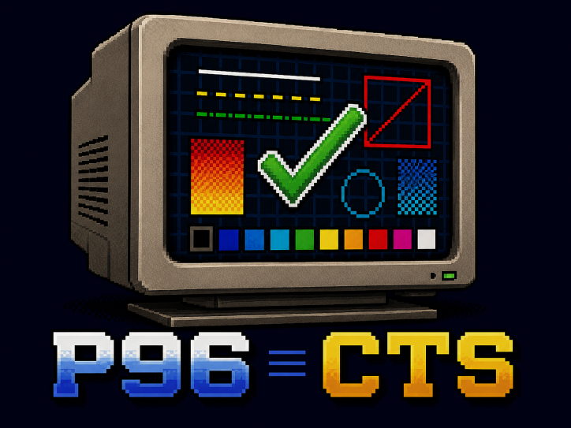

# P96CTS -- P96 driver Conformance Test Suite

Validates the rendering primitives of [P96](https://wiki.icomp.de/wiki/P96)
RTG card drivers as well as the graphics.library accelerated rendering
routines.

Each testcase renders a scene and compares it pixel by pixel against a
committed reference in `golden/`. The references are captured from a working
implementation rather than drawn by hand: they come from `rtg.library`, P96's
own software rasterizer, so a driver is checked against what P96 produces for
the same primitives without a board involved.

Keeping that reference honest takes some care. The bitmap is allocated wider
than any board will accept, which is what forces it into fast memory --
`BMF_USERPRIVATE` alone does not, once the bitmap is friended to a screen's.
Friended it must be, because a pen is not a color on its own: the mapping from
pen number to color comes from the screen, and an unfriended offscreen bitmap
renders every pen black on a truecolor screen. The screen's whole palette is
set explicitly for the same reason -- Intuition initializes only pens 0-3 and
17-19, from the user's Preferences, so a truecolor reference would otherwise
record the colors of the machine it was captured on.

Runs are non-interactive and the exit code reflects the result, so the suite
works as an automated check -- including under an emulator with no display.

This is a different tool from iComp's
[P96Tests](https://aminet.net/package/dev/src/P96Tests), which is an
interactive visual suite by the P96 maintainer and covers far more of the
driver surface. Use that one to look at a driver; use this one to gate a
change.

## Running

Capture the reference from P96's software rasterizer, then compare a board
against it:

    p96cts softrast 320x200x8 CAPTURE
    p96cts Z3660 640x400x8

Output looks like:

    p96cts 0.4 (22.7.2026)
    testing Z3660 640x400x8 clut, scene 320x200
    PASS drawline-solid
    PASS drawline-pattern
    FAIL drawline-complement      4 of 64000 pixels differ
           at 247, 72 golden  89, got 166

Testcases are named `<group>-<test>`, after the group that renders them, and
their images on disk carry the same name.

Reference images live in `golden/<scene>x<depth>/`. A scene that matches writes
nothing -- the file would be a copy of the golden, and encoding every scene
costs more than rendering it. A scene that fails writes two images to
`output/<monitor>/<scene>x<depth>/`: `<test>.fail.png`, what the run actually
rendered, and `<test>.diff.png`, the differing pixels in red over the golden
dimmed to gray.

Images are PNGs, 8-bit palette for a palette run and RGB for a truecolor one,
which compresses these flat synthetic scenes to a few kilobytes at most and can
be viewed anywhere, so the references are committed rather than regenerated. A
palette image carries the same palette the screen was opened with, so it looks
like what was rendered.

### Arguments

`MONITOR` and `MODE` are positional and both required for a run, so the usual
invocation is `p96cts <monitor> <WxHxD>`.

| Argument | Meaning |
|---|---|
| `MONITOR` | Board to render on; `softrast` for the software rasterizer |
| `MODE` | Screen mode as `WxHxD` |
| `TEST/K` | One testcase as `<group>-<test>`; all of them by default |
| `CAPTURE/S` | Write the reference instead of comparing against it |
| `SCENE/K` | Region rendered and compared, as `WxH` (default `320x200`) |
| `GOLDENDIR/K` | Reference directory (default `golden/<scene>x<depth>`) |
| `OUTDIR/K` | Output directory (default `output/<monitor>/<scene>x<depth>`) |
| `THRESHOLD/K/N` | Tolerate up to this many differing pixels |
| `LISTMODES/S` | Dump the display database and exit |
| `LISTTESTS/S` | List the testcase names `TEST` accepts and exit |
| `HELP/S` | Print this table and exit; `-h` and `--help` work too |

`MODE` and `SCENE` are separate because a board need not offer a mode as small
as the scene -- RTG boards typically start around 640x400, and P96's 320x200
entries are mode prefs templates that never open. A smaller scene is drawn into
the corner of a larger screen and only that corner is compared, which keeps
reference images small and comparable across boards with different mode
lists.

## Building

The default include path is where the amiga-gcc toolchain ships the P96
headers, so a containerised build takes no arguments:

    make docker-build

With a toolchain that does not bundle them, point at an unpacked
`P96Develop.lha`:

    make CC=/path/to/bin/m68k-amigaos-gcc \
         P96INC=/path/to/Picasso96Develop/Include

Images are read and written with zlib and libpng, which are committed under
`third_party/` already built for this target, so nothing needs fetching or
cross-building first. They rarely need rebuilding, but when they do, the same
container runs their build script:

    make docker-thirdparty

The archives are reproducible, so a rebuild can be checked byte for byte
against the committed ones. `third_party/README.md` has the upstream versions,
checksums, and why both are built `-noixemul`.

## Adding testcases

A test group is one translation unit in `tests/` exporting a `P96TestGroup`;
see `tests/drawline.c`. Add the file to `OBJS` in the Makefile and the group to
`GROUPS` in `p96cts.c`. Testcases are named for what they do (`solid`,
`overlap-down`); the group supplies the rest of the name.

A testcase renders a complete scene, clearing it first, and must keep all
drawing inside the bitmap: the RastPort has no Layer, so graphics.library does
not clip it and drawing outside corrupts memory.

Scenes should be built so that a wrong driver cannot pass by accident. Drawing
solid lines in one pen, for instance, cannot detect a pixel written twice --
it takes a mode like `COMPLEMENT`, where writing twice is not the same as
writing once, and a figure whose lines actually cross.

## Status

Two depths are supported. 8 compares pen values, read back with
`ReadPixelArray8`. 24 compares R8G8B8 read back through `p96ReadPixelArray`,
which converts from whatever the screen's actual format is -- a 24-bit packed
screen and a 32-bit BGRA one produce identical buffers and share one golden
set:

    p96cts softrast 640x480x24 SCENE=320x200 CAPTURE
    p96cts Z3660 640x480x24 SCENE=320x200

One scene is palette only, and permanently: `fillrect-drawmodes` sweeps its
grid across `rp->Mask`, which selects bitplanes and has no truecolor
counterpart. Everything else runs at both depths.

A palette run also works on native AGA screens, whose bitmaps are planar rather
than chunky, which puts graphics.library's own rendering up against the same
reference:

    p96cts PAL 320x256x8

15/16-bit modes are the deliberate gap: their reference would have to be
rendered at the same 5-6-5 precision, not just converted to it.

## License

0BSD, the same terms iComp chose for P96Tests, so testcases can move freely
between the two and either can be absorbed into a driver tree regardless of
its own license. See `LICENSE`.
