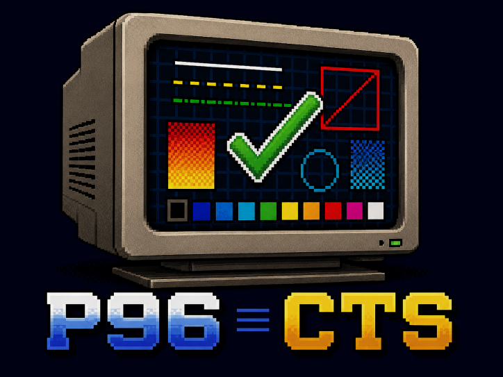

# P96CTS -- P96 driver Conformance Test Suite

Validates the rendering primitives of [P96](https://wiki.icomp.de/wiki/P96)
RTG card drivers as well as the graphics.library accelerated rendering
routines.

Each testcase renders a scene and compares it pixel by pixel against a
golden reference which was generated by P96's software rasterizer.

Runs are non-interactive and the exit code reflects the result, so the suite
works as an automated check -- including under an emulator with no display.

It also runs on AROS, on which it falls back to `cybergraphics.library` and
`graphics.library` instead of Picasso96API.library.

## Running

Run all tests for a particular monitor and video mode (WxHxD):

    p96cts Z3660 640x480x8

Output looks like:

    p96cts 0.12 (30.7.2026) by Bernie Innocenti
    testing Z3660 640x480x8 clut, scene 320x200
    PASS DrawLine-solid
    PASS DrawLine-pattern
    FAIL DrawLine-complement      4 of 64000 pixels differ
           at 247, 72 golden  89, got 166
           at  73,128 golden 202, got  53
           ... and 2 more
           captured output/Z3660/320x200x8/DrawLine-complement.fail.png
           wrote difference to output/Z3660/320x200x8/DrawLine-complement.diff.png

A palette run also works on native AGA screens, whose bitmaps are planar rather
than chunky, which puts graphics.library's own rendering up against the same
reference:

    p96cts PAL 320x256x8

Reference images live in `golden/WxHxD/`. A failing test writes two
images to `output/<monitor>/WxHxD/`:
- `<test>.fail.png`, what the run actually rendered, and
- `<test>.diff.png`, the differing pixels in red over the golden dimmed to gray.

To generate all golden images for a particular scene size and depth, run:

    p96cts softrast 320x200x8 CAPTURE

### Arguments

`MONITOR` and `MODE` are positional and both required for a run, so the usual
invocation is `p96cts <monitor> <WxHxD>`.

| Argument | Meaning |
|---|---|
| `MONITOR` | Board to render on; `softrast` for the software rasterizer |
| `MODE` | Screen mode as `WxHxD` |
| `TEST/K` | One testcase as `<group>-<test>`; all of them by default |
| `CAPTURE/S` | Write the reference instead of comparing against it |
| `SCENE/K` | Region rendered and compared, as `WxH` (default `320x200`) |
| `GOLDENDIR/K` | Reference directory (default `golden/<scene>x<depth>`) |
| `OUTDIR/K` | Output directory (default `output/<monitor>/<scene>x<depth>`) |
| `LISTMODES/S` | Dump the display database and exit |
| `LISTTESTS/S` | List the testcase names `TEST` accepts and exit |
| `HELP/S` | Print this table and exit; `-h` and `--help` work too |

## Test Results

The tables below are from emulators. If you have access to an Amiga with an RTG
board, please run the suite and open an issue to share your results.

### Amiberry

| scene | PAL | uaegfx | CyberVision | ZZ9000 |
|---|---|---|---|---|
| DrawLine-solid | ✅ | ✅ | ✅ | ✅ |
| DrawLine-pattern | ✅ | ✅ | ✅ | ✅ |
| DrawLine-jam2 | ✅ | ✅ | ✅ | ✅ |
| DrawLine-inversvid | ✅ | ✅ | ✅ | ✅ |
| DrawLine-complement | ✅ | ✅ | ✅ | ✅ |
| RectFill-drawmodes | ✅ | ✅ | ✅ | ✅ |
| RectFill-edges | ✅ | ✅ | ✅ | ✅ |
| RectFill-invert | ✅ | ✅ | ✅ | ✅ |
| ClipBlit-overlap | ✅ | ✅ | ✅ | ✅ |
| ClipBlit-disjoint | ✅ | ✅ | ✅ | ✅ |
| BltTemplate-offsets | ✅ | ✅ | ✅ | ✅ |
| BltTemplate-sizes | ✅ | ✅ | ✅ | ✅ |
| BltTemplate-drawmodes | ✅ | ✅| ✅ | ✅ |
| BltTemplate-masks | ✅ | ✅ | ✅ | ✅ |
| BltPattern-drawmodes | ✅ | ✅ | ✅ | ✅ |
| BltPattern-mask | ✅ | ✅ | ✅ | ✅ |
| BltPattern-phase | ✅ | ✅ | ✅ | ✅ |
| BltBitMap-minterms | ✅ | ✅ | ✅ | ✅ |
| BltBitMap-offsets | ✅ | ✅ | ✅ | ✅ |
| BltBitMap-sizes | ✅ | ✅ | ✅ | ✅ |
| BltBitMap-planemask | ✅ | ✅ | ✅ | ✅ |
| BltBitMap-stencil | ✅ | ✅ | ✅ | ✅ |
| BltBitMap-shallow | ✅ | ✅ | ✅ | ✅ |
| ScrollRaster-directions | ✅ | ✅ | ✅ | ✅ |
| ScrollRaster-drawmodes | ✅ | ✅ | ✅ | ✅ |
| ScrollRaster-backfill | - | ✅ | - | ✅ |
| ScrollRaster-amounts | ✅ | ✅ | ✅ | ✅ |
| PixelArray-pens8 | - | ✅ | - | ✅ |
| PixelArray-lut8 | - | ✅ | - | ✅ |
| PixelArray-rgb | - | ✅ | - | ✅ |

A ❌ links to the bug it found. A `-` is untested.

### Copperline

| scene | PAL | Z3660 |
|---|---|---|
| DrawLine-solid | ✅ | ✅ |
| DrawLine-pattern | ✅ | ✅ |
| DrawLine-jam2 | ✅ | ✅ |
| DrawLine-inversvid | ✅ | ✅ |
| DrawLine-complement | ✅ | ✅ |
| RectFill-drawmodes | ✅ | ✅ |
| RectFill-edges | ✅ | ✅ |
| RectFill-invert | ✅ | ✅ |
| ClipBlit-overlap | ✅ | ✅ |
| ClipBlit-disjoint | ✅ | ✅ |
| BltTemplate-offsets | ✅ | ✅ |
| BltTemplate-sizes | ✅ | ✅ |
| BltTemplate-drawmodes | ✅ | ✅ |
| BltTemplate-masks | ✅ | ✅ |
| BltPattern-drawmodes | ✅ | ✅ |
| BltPattern-mask | ✅ | ✅ |
| BltPattern-phase | ✅ | ✅ |
| BltBitMap-minterms | ✅ | ✅ |
| BltBitMap-offsets | ✅ | ✅ |
| BltBitMap-sizes | ✅ | ✅ |
| BltBitMap-planemask | ✅ | ✅ |
| BltBitMap-stencil | ✅ | ✅ |
| BltBitMap-shallow | ✅ | ✅ |
| ScrollRaster-directions | ✅ | ✅ |
| ScrollRaster-drawmodes | ✅ | ✅ |
| ScrollRaster-backfill | ✅ | ✅ |
| ScrollRaster-amounts | ✅ | ✅ |
| PixelArray-pens8 | - | ✅ |
| PixelArray-lut8 | - | ✅ |
| PixelArray-rgb | - | ✅ |

Notes:
* The Z3660 column needs a `Z3660.card` built from git: it depends on
[Z3660#18](https://github.com/shanshe/Z3660/pull/18) and
[Z3660#19](https://github.com/shanshe/Z3660/pull/19), merged after the last
release.
* Z3660#19 leaves `COMPLEMENT` lines to Picasso96, as the ZZ9000 driver already
does. `struct Line` carries no `FRST_DOT`, so an accelerated `COMPLEMENT` line
cannot tell a fresh `Draw()` from one continuing at a vertex, and inverting a
shared vertex twice restores it.
* Z3660#18 uploads the one template line a patterned blit reads. P96 sends the
`JAM2 | COMPLEMENT` tiles as a template blit whose `Template->BytesPerRow` is 0,
so sizing the upload as `BytesPerRow * h` copies nothing and leaves the board to
blit whatever the previous operation left in the template buffer. Why P96 passes
a zero stride here is unexplained.

### AROS

AROS has no Picasso96API.library, so the suite falls back to
`cybergraphics.library` and `graphics.library`. What a red cell finds here is a
divergence in AROS itself rather than in a card driver. Both columns are under
Copperline: PAL is the native planar path, Z3660 the RTG one.

| scene | PAL | Z3660 |
|---|---|---|
| DrawLine-solid | ❌ | ✅ |
| DrawLine-pattern | ❌ | ✅ |
| DrawLine-jam2 | ❌ | ✅ |
| DrawLine-inversvid | ❌ | ✅ |
| DrawLine-complement | ❌ | ❌ |
| RectFill-drawmodes | ✅ | ✅ |
| RectFill-edges | ✅ | ✅ |
| RectFill-invert | ✅ | ✅ |
| ClipBlit-overlap | ✅ | ✅ |
| ClipBlit-disjoint | ✅ | ✅ |
| BltTemplate-offsets | ✅ | ✅ |
| BltTemplate-sizes | ✅ | ✅ |
| BltTemplate-drawmodes | ✅ | ✅ |
| BltTemplate-masks | ✅ | ✅ |
| BltPattern-drawmodes | ❌ | ❌ |
| BltPattern-mask | ❌ | ✅ |
| BltPattern-phase | ❌ | ✅ |
| BltBitMap-minterms | ❌ | ❌ |
| BltBitMap-offsets | ✅ | ✅ |
| BltBitMap-sizes | ✅ | ✅ |
| BltBitMap-planemask | ❌ | ❌ |
| BltBitMap-stencil | ✅ | ✅ |
| BltBitMap-shallow | ✅ | ❌ |
| ScrollRaster-directions | ✅ | ✅ |
| ScrollRaster-drawmodes | ✅ | ✅ |
| ScrollRaster-backfill | ✅ | ❌ |
| ScrollRaster-amounts | ✅ | ✅ |
| PixelArray-pens8 | ✅ | ✅ |
| PixelArray-lut8 | ✅ | ✅ |
| PixelArray-rgb | - | ✅ |

The Z3660 column is red if the scene fails at either depth: `BltBitMap-minterms`,
`BltBitMap-planemask` and `BltBitMap-shallow` fail only at 24 bits,
`BltPattern-drawmodes` and `ScrollRaster-backfill` only at 8. PAL runs at 8 bits
alone, which is why `PixelArray-rgb` has no result there.

The two columns disagree more than they agree, which is the point of running
both: `DrawLine` and the `BltPattern` mask and phase scenes fail only on the
planar path, while `BltBitMap-shallow` and `ScrollRaster-backfill` fail only on
the RTG one.

## Coverage

What each group reaches. The P96 hook is what a card driver has to get right; a
`Default` implementation in P96's shared code stands in for any hook a driver
leaves out, so a missing hook still renders.

| group | graphics.library | P96 hook |
|---|---|---|
| DrawLine | `Move()`, `Draw()` | `DrawLine` |
| RectFill | `RectFill()` | `FillRect`, `InvertRect` |
| ClipBlit | `ClipBlit()` | `BlitRect` |
| BltTemplate | `BltTemplate()` | `BlitTemplate` |
| BltPattern | `BltPattern()` | `BlitPattern` |
| BltBitMap | `BltBitMap()`, `BltMaskBitMapRastPort()` | `BlitRectNoMaskComplete` |
| ScrollRaster | `ScrollRaster()`, `ScrollRasterBF()` | `BlitRect`, `FillRect` |
| PixelArray | `WritePixelArray8()`, `p96WritePixelArray()` | `WriteTrueColorData`, `WriteTrueColorPixels` |

`BltBitMap` also reaches `BlitPlanar2Chunky` and `BlitPlanar2Direct`, which
nothing else here does: a planar source bitmap goes through the first on a CLUT
screen and the second on a truecolor one.

Hooks with no coverage: `WriteYUVRect`, `ScrollPlanar`, `UpdatePlanar`. AROS
calls none of them (see the TODO in `p96gfx_rtg.h`), so scenes for these would
only exercise AmigaOS.

## TODO

- `EraseRect()`: its no-layer path fills through `RectFill()`; no font state to set up.
- `Text()`: renders through `BlitTemplate`; wants a write-mask sweep.
- `ClearEOL()`, `ClearScreen()`: clear to pen 0, or BPen in JAM2. A golden pins one font's metrics.
- `SetRast()`, `Flood()`, `AreaEnd()`, `DrawCircle()`, `DrawEllipse()`: uncovered.
- `BltMaskBitMapRastPort()`: reached only incidentally, via `BltBitMap-stencil`.
- `BltBitMapRastPort()`: uncovered.
- A caller-level group needs a font with identical metrics under AmigaOS and AROS.

## Building

The default include path is where the amiga-gcc toolchain ships the P96
headers, so a containerised build takes no arguments:

    make docker-build

With a toolchain that does not bundle them, point at an unpacked
`P96Develop.lha`:

    make CC=/path/to/bin/m68k-amigaos-gcc \
         P96INC=/path/to/Picasso96Develop/Include

Images are read and written with zlib and libpng, which are committed under
`third_party/` already built for this target, so nothing needs fetching or
cross-building first. They rarely need rebuilding, but when they do, the same
container runs their build script:

    make docker-thirdparty

The archives are reproducible, so a rebuild can be checked byte for byte
against the committed ones. `third_party/README.md` has the upstream versions,
checksums, and why both are built `-noixemul`.

## Adding testcases

A testcase renders a complete scene, clearing it first, and must keep all
drawing inside the bitmap: the RastPort has no Layer, so graphics.library does
not clip it and drawing outside corrupts memory.

Scenes should be built so that a wrong driver cannot pass by accident. Drawing
solid lines in one pen, for instance, cannot detect a pixel written twice --
it takes a mode like `COMPLEMENT`, where writing twice is not the same as
writing once, and a figure whose lines actually cross.

